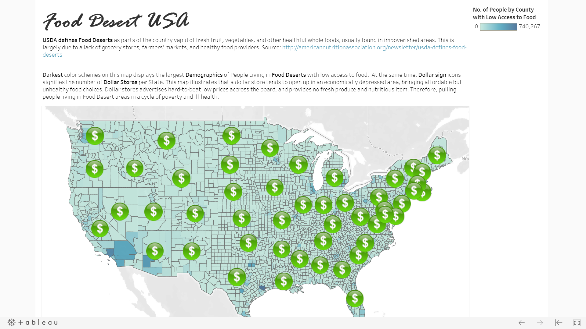

# GW_Project3
Final Project for GW Data Analysis 2019 
2019-08-03

## DATA GUIDE

#### NHANES

SOURCE:
https://wwwn.cdc.gov/nchs/nhanes/Default.aspx

DOCUMENTATION:
https://wwwn.cdc.gov/Nchs/Nhanes/2015-2016/DEMO_I.htm

#### DOLLAR STORES
PRIMARY SOURCE OF DATA: 
Census American Fact Finder search for NAICS code 452990 (All Other General Marchandise Store) 
Description from Census Search: 
*This industry comprises establishments primarily engaged in retailing new goods in general merchandise stores (except department stores, warehouse clubs, superstores, and supercenters). These establishments retail a general line of new merchandise, such as apparel, automotive parts, **dry goods**, hardware, **groceries**, housewares or home furnishings, and other lines in limited amounts, **with none of the lines predominating**.*

RELATED RESEARCH ON DOLLAR STORE: 
**45231** - General Merchandise Stores, including Warehouse Clubs and SupercentersThis industry comprises establishments primarily engaged in retailing new goods in general merchandise stores (except department stores).  These establishments retail a general line of new merchandise, such as apparel, automotive parts, **dry goods**, hardware, groceries, housewares, and home furnishings, with no one merchandise line predominating.  Establishments known as warehouse clubs, superstores, or supercenters are included in this industry.   
Illustrative Examples:  
**Dollar stores**, General merchandise catalog showrooms (except catalog mail-order)General merchandise trading postsGeneral storesHome and auto supply storesSuperstores (i.e., food and general merchandise)Variety storesWarehouse clubs (i.e., food and general merchandise)  

SOURCE:
https://www.census.gov/eos/www/naics/2017NAICS/2017_NAICS_Manual.pdf

NAICS code 452319 - All Other General Merchandise Stores 
**IMPORTANT CODE CHANGES:** 
2017: 452319
2012: 452990
2007: 452990
https://www.naics.com/naics-code-description/?code=452319 

Include these businesses: 
Dollar General Corporation, Goodlettsville, TN 
American Stores Company LLC, Boise, ID 
Big Lots Inc, Columbus, OH  
Big Lots Stores Inc, Columbus, OH 
Pricesmart Inc, San Diego, CA 
Number Holdings Inc, Commerce, CA 
Freds Inc, Memphis, TN 
Five Below Inc, Philadelphia, PA 
Ollies Brgain Outl Hldings Inc, Harrisburg, PA 
Ollies Bargain Outlet Inc, Harrisburg, PA 

#### CENSUS: 452990 - All other general merchandise stores

#### Changes in NAICS CODE:
2017:
452311 General Merchandise Stores, including Warehouse Clubs and Supercenters

2012:
452112 Discount Department Stores - significant perishable grocery sales

SOURCE: https://www.hernandopa-fl.us/PAWebSite/forms/NAICS_%202017_to_2012.pdf

# Grocery Stores
NAICS 445110 - Supermarkets and Other Grocery (except Convenience) Stores  
https://www.naics.com/naics-code-description/?code=445110

# Food Delivery Services and others
NAICS 492210 - Local Messengers and Local Delivery 

Includes: 
Alcoholic beverage delivery service 
Bicycle courier 
Delivery service (except as part of intercity courier network, U.S. Postal Service) 
Grocery delivery services (i.e., independent service from grocery store) 
Local letter and parcel delivery services (except as part of intercity courier network, U.S. Postal Service) 
Messenger service

# USDA Data on SNAP retailers as of June 30, 2019 
#### (Contributor: Monica)
* https://www.fns.usda.gov/snap/retailer-locator
* 248,423 rows 
* Data includes Store_Name, Longitude, Latitude, Address, Address Line #2, City, State, Zip5, Zip4

# Exclusive Dollar Store Data Nationwide: SNAP authorized dollar stores (2008-2018) compiled by Jerry Shannon, Asst. Professor University of Georgia.
#### (Contributor: Monica)
* http://geography.uga.edu/directory/people/jerry-shannon
* 32,291 rows
* Data includes store_name, storeid, addr_num, addr_st, addr_add, city, state, zip5, store_type, stype_num, store_group, stgrp_num

# Food Desert USA Map and Dollar Store Growth
#### (Contributore: Monica)

Website: https://public.tableau.com/profile/monica.zulueta.linsangan#!/vizhome/FD_v1/Dashboard1?publish=yes

USDA defines Food Deserts as parts of the country vapid of fresh fruit, vegetables, and other healthful whole foods, usually found in impoverished areas. This is largely due to a lack of grocery stores, farmers’ markets, and healthy food providers. Source: http://americannutritionassociation.org/newsletter/usda-defines-food-deserts

Darkest color schemes on this map displays the largest Demographics of People Living in Food Deserts with low access to food.  At the same time, Dollar sign icons signifies the number of Dollar Stores per State. This map illustrates that a dollar store tends to open up in an economically depressed area, bringing affordable but unhealthy food choices. Dollar stores advertises hard-to-beat low prices accross the board, and provides no fresh produce and nutritious item. Therefore, pulling people living in Food Desert areas in a cycle of poverty and ill-health.

